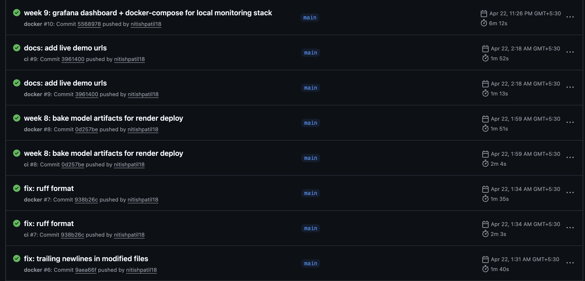

# presentation slides

outline for a 10-minute final review. 12 slides. each slide block shows the title on top, key points as bullets, and speaker notes in italics below. convert to keynote / powerpoint / google slides by copying each section.

---

## slide 1: title

**fraud detection mlops: end-to-end ml system**

nitish patil  
final-year project, cse (ai & ml)  
ramaiah institute of technology

*speaker notes: 15 seconds. name, branch, project title. move on fast.*

---

## slide 2: the problem

- credit card fraud costs banks billions every year
- ml models for fraud are common; deployable ml systems are rare
- gap: most academic projects stop at a jupyter notebook
- this project closes the gap

*speaker notes: 30 seconds. set up the contrast between "having a model" and "running a system". the system is the contribution.*

---

## slide 3: dataset

- ieee-cis fraud detection, 590,540 transactions
- 394 features (transaction + device identity)
- **3.5% fraud rate** (heavy class imbalance)
- **182 consecutive days** (time-series structure)
- ~24% of rows have matching identity data

*speaker notes: 30 seconds. emphasize imbalance (drives metric choice) and time structure (drives split strategy).*

---

## slide 4: architecture

show the ascii diagram from `docs/architecture.md`, or redraw as boxes and arrows.
raw csv -> prepare_data -> parquet
parquet -> train.py -> mlflow (params, metrics, model)
mlflow -> export_model -> build/model
build/model -> docker image -> render api
render api -> render postgres
render api -> streamlit frontend
render postgres -> grafana dashboard
render postgres -> drift detection

*speaker notes: 60 seconds. walk through top to bottom. emphasize that serving has no runtime dependency on mlflow.*

---

## slide 5: design decisions

1. time-based split, not random
2. pr-auc, not accuracy
3. `scale_pos_weight`, not smote
4. xgboost on label-encoded categoricals
5. hydra for config
6. fastapi + pydantic
7. model baked into docker image
8. background-task logging
9. postgres jsonb for features
10. split ci and prod dockerfiles

*speaker notes: 60 seconds. don't read all ten. pick any 3 to mention, say "the rest are in the decisions doc".*

---

## slide 6: training pipeline

- hydra config, cli overrides for experiments
- xgboost with early stopping on val pr-auc
- mlflow logs every run
- 5 experiments: baseline, depth4, smoke_test, baseline_v2, baseline_fast
- deployed model: `baseline_fast` (300 trees, depth 6)

**results (test set)**:
- pr-auc: 0.51 (15x better than random)
- roc-auc: 0.89
- recall @ p=0.5: 0.45
- recall @ p=0.9: 0.27

*speaker notes: 45 seconds. mention the 15x improvement over random baseline; that's the honest framing for imbalanced data.*

---

## slide 7: live api

- deployed at render.com (singapore)
- 3 endpoints: `/health`, `/info`, `/predict`
- pydantic input validation
- model baked into docker image (no mlflow at runtime)
- auto-deploys on push to main

**link**: https://fraud-api-5dxn.onrender.com/docs

*speaker notes: 30 seconds. open the /docs page during the live demo portion.*

---

## slide 8: prediction logging

- every `/predict` logs to postgres asynchronously
- columns: timestamp, model_run_id, features (jsonb), probability, is_fraud, threshold, latency_ms
- background task: doesn't add latency
- degrades gracefully if db is down

*speaker notes: 30 seconds. "observability without adding to the user-facing critical path."*

---

## slide 9: monitoring

- grafana dashboard: 8 panels, 30s refresh
- predictions per minute, fraud rate, latency p95, traffic by model version
- drift detection with evidently ai
- github actions cron runs daily drift check
- non-zero exit code triggers alert step

*speaker notes: 30 seconds. during demo, open the grafana dashboard. the visual of live production charts is the most persuasive thing in the whole presentation.*

---

## slide 10: ci/cd

- every push: ruff lint, ruff format check, mypy, pytest (10 tests)
- every push to main: docker build + import smoke test
- daily cron: drift check
- deploy: render auto-pulls on push

*speaker notes: 30 seconds. the green badges matter. this is the single biggest signal that you built real software, not a notebook dump.*

---

## slide 11: limitations and next steps

**current limitations**:
- ~1s production inference latency (render free tier, pandas overhead)
- single model, single threshold (no per-segment thresholds)
- no shadow/canary deployment

**next work**:
- numpy inference path (~10x latency reduction)
- model registry with staged promotion
- shadow deployment for safe rollout
- per-feature drift thresholds

*speaker notes: 45 seconds. naming weaknesses honestly is disarming; interviewers respect it more than hiding them.*

---

## slide 12: summary

**one api, one ui, one dashboard, one ci pipeline, one database, one model**

- code: ~1,800 lines, 10 tests
- infrastructure: docker compose local + render cloud
- artifacts: model baked into container, parquet features, sqlite-backed mlflow
- public: https://github.com/nitishpatil18/fraud-detection-mlops

*speaker notes: 15 seconds. short. let it land.*

thank you.